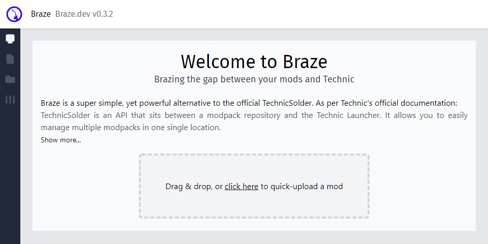

<p align="center">
  <a href="https://github.com/thatsimplekid/braze">
    
  </a>

  <h3 align="center">Braze</h3>

  <p align="center">
    A 'fork' of solder, without the painful setup!
    <br />
    <a href="https://github.com/thatsimplekid/braze/wiki"><strong>Explore the docs »</strong></a>
    <br />
  </p>

  <p align="center">
    <a href="https://github.com/BrazeDev/Braze/graphs/contributors" target="_blank">
      
    </a>
    <a href="https://github.com/BrazeDev/Braze/network/members" target="_blank">
      
    </a>
    <a href="https://github.com/BrazeDev/Braze/stargazers" target="_blank">
      
    </a>
    <a href="https://github.com/BrazeDev/Braze/issues" target="_blank">
      
    </a>
    <a href="https://github.com/BrazeDev/Braze/stargazers" target="_blank">
      
    </a>
    <a href="https://discord.gg/u7wG9ZSNRn" target="_blank">
      
    </a>
    <a href="https://github.com/thatsimplekid/Braze/blob/master/LICENSE" target="_blank">
      
    </a>
  </p>
</p>

<details open="open">
  <summary>Table of Contents</summary>
  <ol>
    <li>
      <a href="#about-the-project">About The Project</a>
      <ul>
        <li><a href="#built-with">Built With</a></li>
      </ul>
    </li>
    <li><a href="#installation">Installation</a></li>
    <li><a href="#running-the-app">Running the app</a></li>
    <li><a href="#testing-the-app">Testing the app</a></li>
    <li><a href="#roadmap">Roadmap</a></li>
    <li><a href="#contributing">Contributing</a></li>
    <li><a href="#license">License</a></li>
    <li><a href="#contact">Contact</a></li>
    <li><a href="#thanks">Thanks</a></li>
  </ol>
</details>

## About The Project

<p align="center">

</p>

This section will be populated at a later point. 

### Built With

This section will be populated at a later point.

## Installation

```bash
$ yarn install
```

## Running the app

```bash
# development
$ yarn start

# watch mode
$ yarn start:dev

# production mode
$ yarn start:prod
```

## Testing the app

```bash
# unit tests
$ yarn test

# e2e tests
$ yarn test:e2e

# test coverage
$ yarn test:cov
```

## Roadmap

See the [open issues](https://github.com/thatsimplekid/braze/issues) for a list of proposed features (and known issues).

## Contributing

Contributions are what make the open source community such an amazing place to learn, inspire, and create. Any contributions are **greatly appreciated**.

1. Fork the Project
2. Create your Feature Branch (`git checkout -b feature/newfeature`)
3. Commit your Changes (`git commit -m 'Adds feature: newfeature'`)
4. Push to the Branch (`git push origin feature/newfeature`)
5. Open a Pull Request

If you wish to contribute to the development monetarily, I accept donations via crypto:

BTC ``

## License

Distributed under the MIT License. See `LICENSE` for more information.

## Contact

Your Name - [LinkedIn](https://www.linkedin.com/in/owen-flaherty-4bb21214a/) - fl@herty.xyz

Project Link: [https://github.com/thatsimplekid/braze](https://github.com/thatsimplekid/braze)

## Thanks

* The [TechnicPack](https://github.com/TechnicPack) team 
